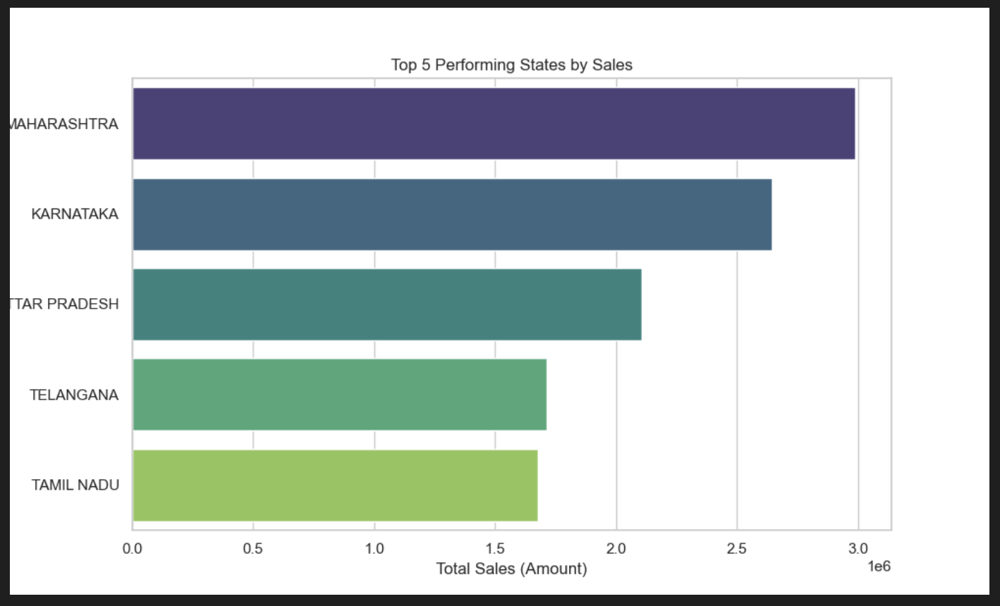
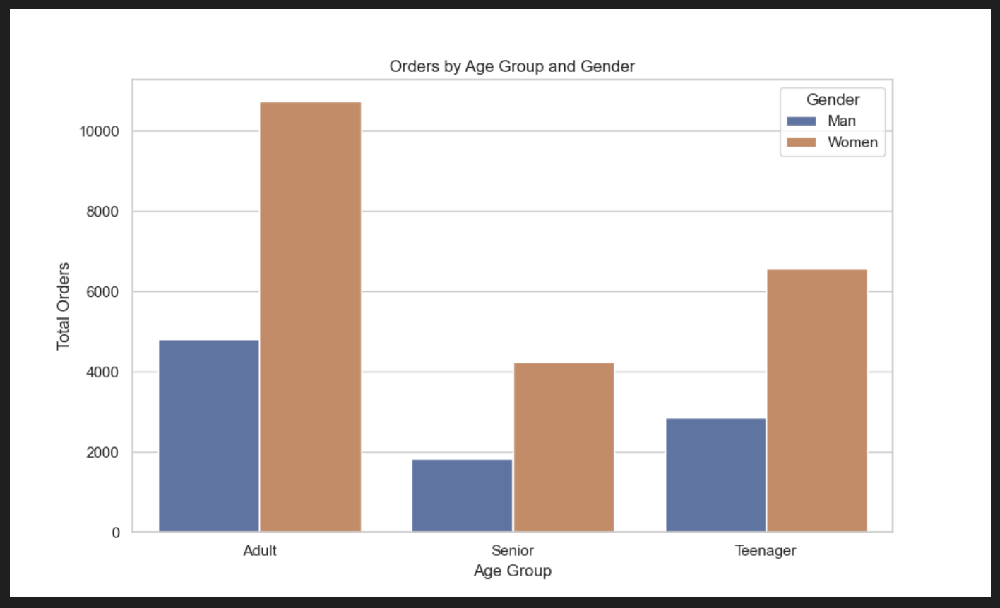

# 🛒 Vrinda Store Data Analytics Project

## 📜 Executive Summary
This project delivers a comprehensive end-to-end data analysis of the **Vrinda Store's** 2022 annual sales data. By leveraging Python and data science libraries (Pandas, Matplotlib, Seaborn), I transformed raw, inconsistent Excel data into actionable business insights. The analysis identifies key customer demographics, peak sales periods, and high-performing regions, providing a data-driven roadmap for the store's growth in 2023.

---

## 🛠️ Technical Stack
- **Language:** Python 3.13
- **Data Manipulation:** [Pandas](https://pandas.pydata.org/)
- **Data Visualization:** [Matplotlib](https://matplotlib.org/), [Seaborn](https://seaborn.pydata.org/)
- **Data Source:** Microsoft Excel (`.xlsx`)

---

## ⚙️ How the Project Works (Workflow)

### 1. Data Cleaning (The Foundation)
Raw data is often noisy. The script performs:
- **Gender Standardization:** Unified inconsistent entries (e.g., 'M', 'Men' → 'Man'; 'W', 'Women' → 'Women').
- **Quantity Correction:** Converted string-based quantities (like 'One', 'Two') into numerical integers for calculation.
- **Integrity Checks:** Removed records with missing values in critical fields like `Amount`, `Category`, and `Status` to ensure analysis accuracy.

### 2. Feature Engineering (Adding Value)
To gain deeper insights, I derived new metrics:
- **Age Grouping:** Segregated customers into `Teenager` (<30), `Adult` (30-49), and `Senior` (50+) to target marketing efforts.
- **Time-Series Extraction:** Extracted the `Month` from transaction dates to visualize seasonal sales fluctuations.

### 3. Data Analysis & Visualization
The project answers 6 pivotal business questions:
1. **Monthly Trends:** Comparing Sales vs. Order counts to identify peak seasons.
2. **Gender Performance:** Visualizing who the primary spenders are.
3. **Order Status:** Tracking the efficiency of the delivery pipeline (% Delivered vs. Returned/Cancelled).
4. **Regional Analysis:** Identifying the top 5 states contributing to revenue.
5. **Demographic Deep-Dive:** Analyzing the intersection of Age and Gender.
6. **Channel Efficiency:** Comparing platform performance (Amazon, Flipkart, Myntra, etc.).

---

## 📊 Data Visualizations

### 1. Monthly Sales & Order Trends


### 2. Sales by Gender & Comparison


### 3. Order Status Breakdown


### 4. Top 5 Performing States


### 5. Age & Gender Analysis


### 6. Sales by Channel


---

## 📈 Key Business Insights
- **The Power User:** The highest value customer segment is **Adult Women (Age 30-49)** living in **Maharashtra, Karnataka, and Uttar Pradesh**.
- **The Peak:** **March** stands out as the highest sales month, suggesting a successful end-of-quarter or seasonal campaign.
- **Platform Dominance:** **Amazon and Flipkart** account for the majority of the sales volume, highlighting the importance of these channels for inventory focus.
- **Conversion:** Over **90%** of orders are successfully delivered, indicating a healthy logistics flow.

---

## 🚀 Impact for Recruiters
This project demonstrates my ability to:
- **Handle Real-World Data:** Dealing with inconsistencies and cleaning data effectively.
- **Communicate Visually:** Crafting clear, professional-grade charts that stakeholders can easily interpret.
- **Extract Meaning:** Not just running code, but translating data into "The Why" and "The What Next" for a business.
- **Python Proficiency:** Writing clean, modular, and reusable code for data processing.

---

## 📂 Project Structure
- `main.py`: The core engine performing cleaning, processing, and visualization.
- `Store_data_analysis.xlsx`: The primary dataset.
- `outputs/`: Automatically generated directory containing all insight charts.
- `README.md`: Basic project setup and technical requirements.

## 🏃 Ready to Run?
1. Install dependencies:
   ```bash
   pip install pandas matplotlib seaborn openpyxl
   ```
2. Execute the script:
   ```bash
   python3 main.py
   ```
3. Check the `outputs/` folder for your visual reports!
